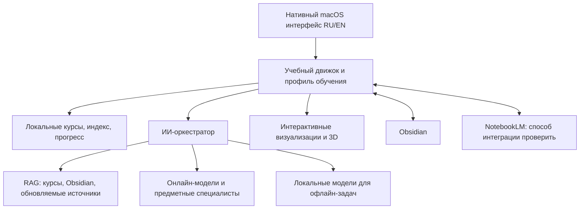

# ColiDev — объединённая macOS-платформа

Рабочий план объединения текущего ColiDev и расширенной идеи учебного ИИ-тьютора. Этот документ фиксирует требования, текущее состояние реализации, предложения и открытые решения. Начат отдельный нативный macOS-клиент в `macOS/ColiDev`; статус и ограничения ведутся в соответствующих категориях.

Копируемое задание на проектирование и разработку всего приложения собрано в [двуязычном промпте для разработчика](APP_BUILD_PROMPT.md); это бриф продукта, а не системная инструкция для поведения тьютора.

Краткий двуязычный профиль продукта для GitHub собран в [README проекта](../README.md#project-profile--профиль-проекта); здесь хранится подробный рабочий план.

## Подтверждённое направление

Сделать один полноценный продукт для macOS, объединяющий обучение Python/backend из ColiDev с универсальной платформой для изучения всех важных направлений с самого начала. Приложение должно иметь русскую и английскую локализации. Нужны гибридные онлайн- и офлайн-режимы, RAG для актуальных данных, оркестрация ИИ-агентов, визуальные и интерактивные объяснения, включая 3D-сцены, интеграции с Obsidian и NotebookLM, а также тщательно спроектированный интерфейс по принципам Apple.

## Дальнейшее расширение продукта

После готового и проверенного релиза macOS добавить Windows-приложение с функциональным паритетом. Затем подготовить сайт продукта, откуда пользователи смогут скачивать установщики macOS и Windows; клонировать GitHub-репозиторий для установки им не понадобится. Конкретный Windows UI-стек, форматы установщиков, подпись и обновления предстоит выбрать.

## Важные ограничения плана

- XGENT — отдельный проект; его код, история и файлы не включать в ColiDev.
- С первого запуска доступны направления: математика, английский язык, физика, биология, зоология и программирование; список областей может расширяться. По каждому предмету и теме путь обучения идёт от базы к углублённым темам и специализациям через теорию, интерактивные тренажёры и практику; система даёт обратную связь и проверяет, что ученик сделал и понял. Зоология также связана с биологией. Русский и английский доступны в интерфейсе и обучении.
- Запрос на мощные модели с большими бесплатными лимитами — цель подбора, не гарантия: лимиты и доступность провайдеров меняются, нужны запасные маршруты и явный бюджет.
- Актуальность знаний должна обеспечиваться источниками, индексированием, датами обновления и цитированием, а не обещанием, что модель «всё знает».
- NotebookLM, конкретные модели, 3D-технология, минимальная версия macOS и состав первого релиза ещё не выбраны.

## Схема целевого продукта (черновик)

## Категории

- [01. Продукт и границы](categories/01-product.md)
- [02. Текущее состояние ColiDev](categories/02-current-state.md)
- [03. macOS-архитектура](categories/03-architecture.md)
- [04. ИИ, агенты и RAG](categories/04-ai.md)
- [05. Курсы и обучение](categories/05-learning.md)
- [06. Obsidian, NotebookLM, визуализации и 3D](categories/06-knowledge-and-media.md)
- [07. Безопасность, приватность и стоимость](categories/07-security-cost.md)
- [08. Этапы реализации](categories/08-roadmap.md)
- [09. Решения и открытые вопросы](categories/09-decisions.md)
- [10. Журнал обсуждений](categories/10-session-notes.md)
- [11. Обратная связь и критерии готовности](categories/11-feedback-and-acceptance.md)

## Правило ведения

Обновлять нужную категорию после обсуждений. Отмечать каждый пункт как **подтверждённое требование**, **факт из текущего кода**, **предложение**, **не проверено** или **открытый вопрос**. Архитектурные решения фиксировать после согласования; не выдавать планы за реализованные функции.

Новый авторский текст на английском в README, профилях, плане, журнале и описаниях продукта сразу сопровождать полным переводом на русский. В учебных материалах для английского языка сами примеры оставлять на английском, но рядом давать полный перевод или пояснение по-русски. Названия API, моделей, файлов, команд и кода сохранять в исходном виде; переводить их механически нельзя.

